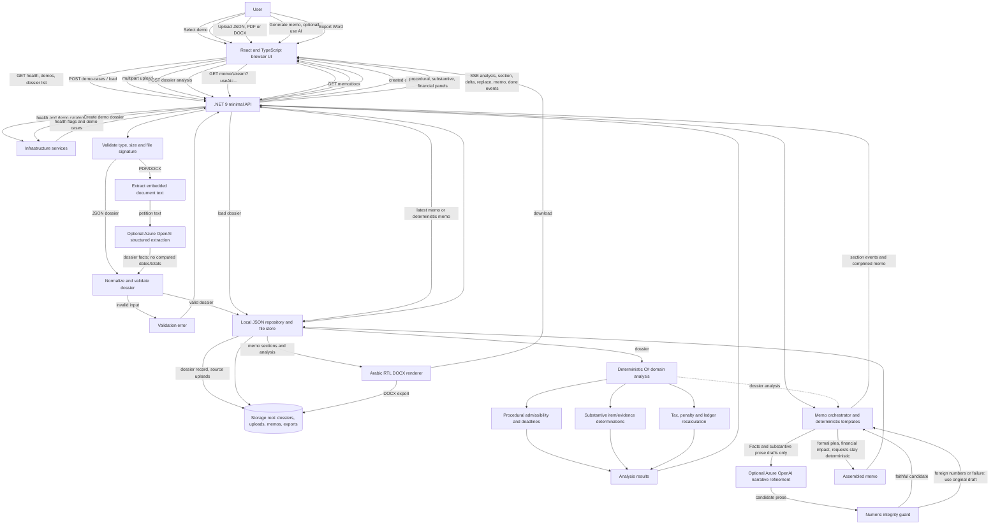

# Data-flow diagram

The diagram distinguishes deterministic processing from optional AI calls. Azure OpenAI is only used for petition extraction and (when selected) limited narrative refinement. All case decisions and financial calculations are performed by the C# domain services.

## Flow notes

- The browser talks to the API for dossier operations and subscribes to the memo stream with `EventSource`/SSE.
- PDF/DOCX uploads pass through extension, size, and file-signature validation before text extraction. The text is sent to Azure OpenAI only if the extractor is enabled. JSON uploads bypass text extraction and AI extraction.
- With JSON and PDF/DOCX in the same upload, the JSON is the dossier source and the other files are archived as attachments.
- `CaseAnalysisService` invokes deterministic domain services. AI does not determine procedural admissibility, dates, statutory deadlines, item outcomes, penalties, or totals.
- The memo templates retain deterministic formal plea, financial-impact, and requests sections. Only the Facts and Substantive defense sections are eligible for Azure rephrasing. The numeric guard enforces fallback to template text if the candidate is empty or contains an unapproved number.
- Dossiers, latest memo JSON, uploaded source files, and generated DOCX exports are stored beneath `Storage:RootPath` (default `./data` from the API working directory). An in-memory cache accelerates reads; it is not the persistent record.
